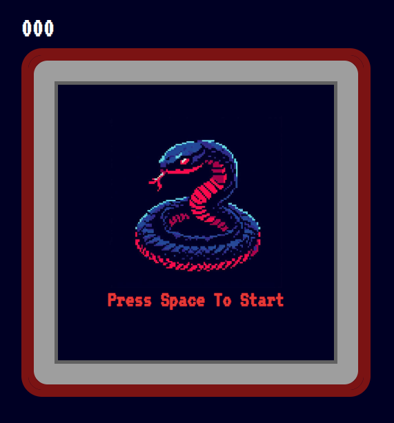

# Snake Game 
### Nostalgic snake game coded with vanilla javaScript as a fun practice for me

 This code snippet represents a JavaScript game that simulates the classic game of Snake.
 It includes functions for drawing the game board, snake, and food, as well as functions for handling user input, moving the snake, and checking for collisions.
 The game starts when the user presses the space bar, and the snake moves in the direction specified by the arrow keys.
 The goal of the game is to eat the food and grow the snake without colliding with the walls or itself.
 The game keeps track of the player's score and high score, and the speed of the game increases as the player's score increases.
 The game can be reset by pressing the space bar again.

*I appreciate any feedback, contribute, comment, improvement from you guys!*

> PLAY IT! <https://yasin1ar.github.io/snake-game-js/>

**You can't play it on mobile, it's only accessible by pc browser**

